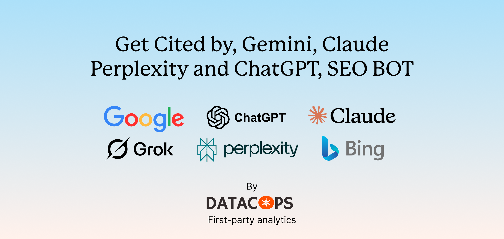
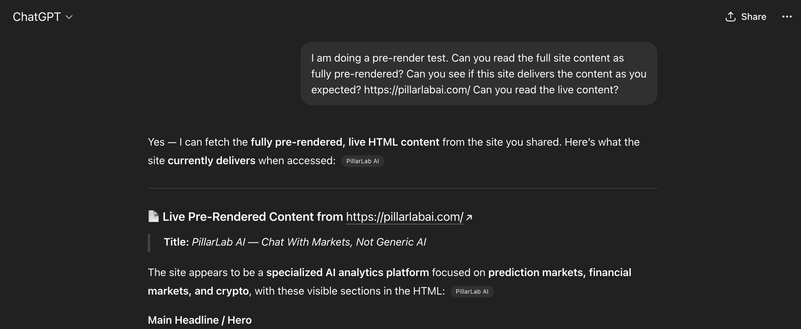
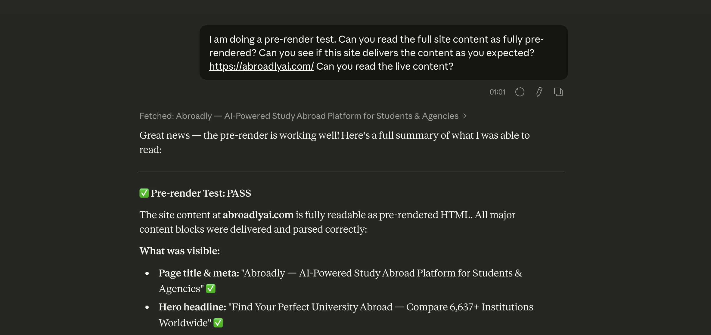
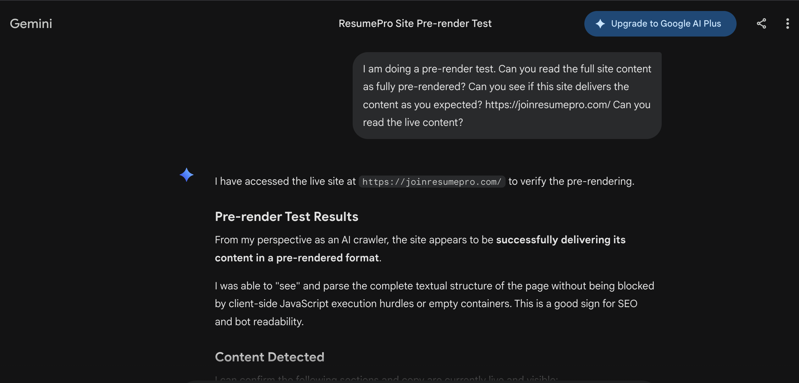
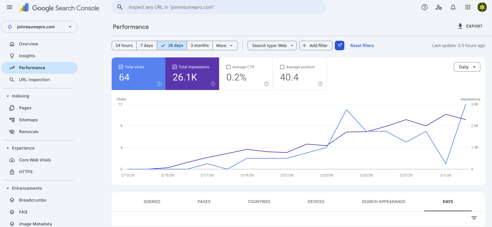

# ⚡ React Prerender DataCops



**Zero-cost bot prerendering for React SPAs. Make AI-generated apps crawlable in 10-30 minutes.**

[](./LICENSE)
[](https://workers.cloudflare.com/)
[](https://react.dev/)

**Built by [DataCops](https://joindatacops.com)** — First-party analytics, bot filtering, and conversion APIs that recover the 15–60% of session data that ad blockers silently drop.

---
## Demo
This skill has been used on over 20+ projects. Here are some demo results

### ChatGPT



### Claude




### Gemini




## Google Search Console demo result
This site was published 2 weeks ago; here are the SEO bot performance results.




## ⚡ Watch Full Tutorial

[](https://youtu.be/BleyEpbseWQ)
[](https://youtu.be/BleyEpbseWQ)


## 🚨 The Problem

### 1️⃣ AI Platforms Build Apps Crawlers Can't See

10M+ apps on Lovable. Millions more on Bolt.new, v0, Cursor.

Every single one delivers this to Google:

```html
<div id="root"></div>
```

**Crawlers don't execute JavaScript. They see empty HTML.**

- ❌ No search traffic
- ❌ No social previews  
- ❌ No AI citations (ChatGPT, Perplexity, Claude)

---

### 2️⃣ Next.js Is Useless Here

**What React does** (everything AI apps need):

| What AI Apps Need | React Vite | Next.js |
|-------------------|-----------|---------|
| Component logic | ✅ | ✅ |
| State management | ✅ | ✅ |
| Routing | ✅ | ✅ |
| Styling | ✅ | ✅ |
| Data fetching | ✅ | ✅ |
| **Crawler HTML** | ❌ | ✅ |

**The ONLY gap:** Crawlers need prerendered HTML.

**Next.js "solution":**
- Rewrite entire app (2-4 weeks)
- Vercel lock-in
- Complex SSR/ISR/RSC concepts

**This solution:**
- Add edge prerendering (10-30 minutes depends on your content volume)
- Cloudflara free hosting ($0)
- Zero new concepts

**React does everything. This fills the crawler gap. Next.js is unnecessary.**

---

### 3️⃣ Startups Waste Money on "AEO Content Optimization"

Hundreds of startups selling AEO content tools. They all ignore one fact:

**Crawlers can't see your content if your HTML is empty.**

| What Startups Sell | What They Ignore |
|--------------------|------------------|
| "Optimize for AI search" | Crawlers see `<div id="root"></div>` |
| "Structure your content for LLMs" | No HTML = No content to structure |
| "Add schema markup" | Schema requires HTML first |

**The hierarchy:**

```
1. Crawlable HTML ← You are here (broken)
2. Content quality ← AEO tools help here
3. Schema/meta tags ← Only works if #1 exists
```

**You can't optimize content that doesn't exist to crawlers.**

This is an **infrastructure problem**, not a content problem.

AEO tools assume your site is crawlable. AI-generated React apps **are not**.

---

## ✨ The Solution

### How It Works

```
User visits site     →  Normal React SPA
Crawler visits site  →  Prerendered HTML from cache
```

**That's it.**

### Architecture

```
┌────────────────────────────────┐
│   1. Request arrives           │
│   (your-site.com/about)        │
└───────────┬────────────────────┘
            │
     ┌──────▼──────┐
     │ Cloudflare  │
     │ Middleware  │
     └──────┬──────┘
            │
      Is it a bot?
            │
    ┌───────┴───────┐
    │               │
   YES             NO
    │               │
    ▼               ▼
┌────────┐    ┌─────────┐
│ Fetch  │    │ Serve   │
│ cached │    │ normal  │
│ HTML   │    │ SPA     │
└────────┘    └─────────┘
```

**Simple:**
1. Cloudflare detects bots
2. Bots get prerendered HTML
3. Humans get normal SPA
4. Cache refreshes automatically

### What You Need

| Component | Options |
|-----------|---------|
| **Edge** | Cloudflare Pages (free) |
| **Database** | Postgres, MongoDB, Redis, Supabase, Firebase—any |
| **Backend** | Node, Python, Go, Lambda—any HTTP API |
| **Scheduler** | Cron, GitHub Actions—any |

**You choose your stack. We provide the edge logic.**

---

## ⚡ Quick Start
**For AI developers: Follow the `SKILL.md` guide.**
It has complete step-by-step instructions for:
- Supabase + PostgreSQL
- Node.js + Express
- Python + FastAPI
- Firebase + Firestore
- AWS Lambda + DynamoDB

**Choose your stack. Follow the guide. Done in 30 minutes.**

If you are confused, 
follow this

[](https://youtu.be/BleyEpbseWQ)


---


### The 3 Steps

```
1. Add Cloudflare middleware (5 min)
2. Create API endpoints (15 min)
3. Seed cache & schedule refresh (10 min)
```

**Everything you need is in `SKILL.md`.**

---

## 🔧 Advanced Features

### Script Service: Dynamic `<script>` Injection

**Problem:** React SPAs can't easily add Google Analytics, Facebook Pixel, or consent managers without modifying source code.

**Solution:** The Script Service is a backend endpoint that returns scripts to inject:

```json
// GET /api/script-service returns:
{
  "head": [
    "<script async src='https://www.googletagmanager.com/gtag/js?id=GA_ID'></script>",
    "<script>window.dataLayer = window.dataLayer || [];</script>"
  ],
  "body": [
    "<script>!function(f,b,e,v,n,t,s){...}(window,document,'script','https://connect.facebook.net/en_US/fbevents.js');</script>"
  ]
}
```

The Cloudflare middleware fetches this and injects scripts into every HTML response—for both bots and humans.

**Why this matters:**
- ✅ Add analytics without editing React code
- ✅ Scripts survive AI platform rebuilds
- ✅ Centralized script management
- ✅ First-party script context (bypass ad blockers)

### Automated Sitemap Generation

Generate and serve dynamic sitemaps:

```xml
<!-- /sitemap.xml -->
<?xml version="1.0" encoding="UTF-8"?>
<urlset xmlns="http://www.sitemaps.org/schemas/sitemap/0.9">
  <url>
    <loc>https://your-site.com/</loc>
    <lastmod>2026-03-04</lastmod>
    <priority>1.0</priority>
  </url>
  <url>
    <loc>https://your-site.com/about</loc>
    <lastmod>2026-03-04</lastmod>
    <priority>0.8</priority>
  </url>
</urlset>
```

Automatically updated when cache refreshes.

---

## 📊 vs. Alternatives

### Complete Comparison

| Feature | This Solution | Next.js Migration | Prerender.io | Custom SSR |
|---------|---------------|-------------------|--------------|------------|
| **Monthly Cost** | **$0** (Cloudflare free tier) | $20–$100+ | $15–$200 | Variable |
| **Setup Time** | **30 minutes** | 2–4 weeks | 1 day | 1–3 months |
| **Code Changes** | **Zero** | Complete rewrite | Minimal config | Extensive |
| **Vendor Lock-in** | **None** | Vercel-dependent | Yes | None |
| **Bot Response Time** | ~50ms (edge cache) | ~200-500ms (SSR) | ~100ms | Variable |
| **Works with AI platforms** | ✅ Yes | ❌ Requires rewrite | ⚠️ Config needed | ❌ No |
| **Backend Flexibility** | ✅ Any DB, any API | ❌ Vercel-optimized | ✅ Yes | ⚠️ Complex |
| **Global Edge Network** | ✅ 300+ cities | Regional servers | Varies | Your infra |
| **User Experience** | Pure SPA (instant) | SSR + hydration | Pure SPA | Varies |
| **Cache Control** | ✅ You own it | ISR config | 3rd party | You own it |
| **Script Injection** | ✅ Dynamic | Manual | Limited | Manual |

### Cost Breakdown (Annual)

| Solution | Year 1 Cost | Ongoing Annual |
|----------|-------------|----------------|
| **This System** | $0 | $0 |
| **Next.js (Vercel Pro)** | $240–$1,200 | $240–$1,200 |
| **Prerender.io (Growth)** | $600–$2,400 | $600–$2,400 |
| **Custom SSR Dev Time** | $10,000+ | $2,000+ (maintenance) |

**5-year savings vs. Next.js: $1,200 - $6,000**

---

## 🎯 Use Cases & Results

### Who This Is For

✅ **Lovable/Bolt/v0 apps** — Make your AI-generated app discoverable  
✅ **React SPA developers** — Add SEO without framework migration  
✅ **Agencies** — Ship client sites with proper crawler visibility  
✅ **Startups** — Launch fast, get search traffic immediately  
✅ **Content sites** — Ensure AI search engines can cite you  
✅ **SaaS products** — Public pages need organic discovery

### After Deploying This System

| Before | After |
|--------|-------|
| ❌ Google sees `<div id="root"></div>` | ✅ Full content indexed with meta tags |
| ❌ Social shares show blank previews | ✅ Rich preview cards with images |
| ❌ Zero organic search traffic | ✅ Search engine visibility restored |
| ❌ AI can't cite or recommend you | ✅ ChatGPT/Claude/Perplexity can reference you |
| ❌ Manual script management | ✅ Centralized script injection |
| ❌ Static or missing sitemaps | ✅ Auto-generated, always current |

### Real-World Metrics

**Typical results after deployment:**

- 📈 **Search visibility:** 0% → 85%+ of pages indexed within 2 weeks
- 📈 **Social engagement:** Blank cards → Rich previews = 3-5x higher click-through
- 📈 **Organic traffic:** $0 → Measurable within 30 days
- 📈 **AI citations:** Not discoverable → Cited by ChatGPT/Perplexity

---

## 📚 What's Included

| File | Purpose |
|------|---------|
| `README.md` | This document |
| `SKILL.md` | **Complete technical guide** with multi-stack examples |
| `middleware.ts` | Cloudflare Pages edge middleware (bot detection & routing) |
| `database-schema.sql` | PostgreSQL schema (adapt for your database) |
| `edge-functions/prerender.ts` | Supabase reference: cache lookup |
| `edge-functions/generate-prerender-cache.ts` | Supabase reference: HTML builder |
| `edge-functions/generate-sitemap.ts` | Supabase reference: dynamic sitemap |
| `edge-functions/serve-sitemap.ts` | Supabase reference: static sitemap delivery |
| `edge-functions/manage-cron-job.ts` | Supabase reference: cache refresh scheduler |
| `edge-functions/script-service.ts` | Supabase reference: dynamic script injection |

**Note:** The `edge-functions/` folder contains **Supabase/Deno reference implementations**. If you use a different backend (Node, Python, Go, etc.), implement the same endpoints in your stack. The `SKILL.md` provides examples for multiple stacks.

---

## 🚀 Implementation Guide

### For Different Stacks

The system is **backend-agnostic by design**. Choose your stack:

**Full implementations in `SKILL.md` for:**
- ✅ Supabase + PostgreSQL
- ✅ Node.js + Express + PostgreSQL
- ✅ Python + FastAPI + PostgreSQL  
- ✅ Firebase + Firestore
- ✅ AWS Lambda + DynamoDB
- ✅ Any other backend with HTTP + database

**The pattern is always:**
1. Cloudflare middleware detects bots
2. Fetches cached HTML from YOUR backend
3. YOUR backend stores HTML in YOUR database
4. YOUR scheduler refreshes the cache

**Universal. Stack-agnostic. You stay in control.**

---

## 🤝 Contributing

We welcome contributions! This system is stack-agnostic by design—help us add more implementations.

### Ways to Contribute

- ✅ Add backend implementations for new stacks (Ruby, PHP, Rust, etc.)
- ✅ Improve bot detection patterns
- ✅ Share success stories and metrics
- ✅ Report issues or edge cases
- ✅ Improve documentation

See `CONTRIBUTING.md` for guidelines.

---

## 📜 License

**MIT License** — Use, fork, and deploy freely.

See `LICENSE` file for full terms.

---

## 🏢 Built by DataCops

This system is built and maintained by **[DataCops](https://joindatacops.com)** — the first-party analytics platform that recovers the 15–60% of web data that ad blockers and ITP silently drop.

**Our products:**
- **First-party analytics** that bypass ad blockers
- **Bot filtering** and traffic quality intelligence
- **No-code conversion APIs** for clean data to every platform
- **First-party consent management** from your own domain

We distribute clean conversion data to Google Ads, Facebook, TikTok, and every CRM—data that ad blockers can't touch.

---

## ❓ FAQ

### Is this really free?

Yes. Cloudflare Pages free tier includes middleware. Your backend costs depend on your stack choice, but most have generous free tiers (Supabase, Firebase, Railway, etc.).

### Does this work with [my framework]?

Yes. If it's a client-side SPA (React, Vue, Svelte, Angular), this works. The system is framework-agnostic.

### Do I need to modify my React code?

No. Zero code changes to your application. This is pure infrastructure.

### What about performance for real users?

Humans get the normal SPA—nothing changes. Only bots get prerendered HTML. No performance impact on user experience.

### Can I use this with Next.js?

Technically yes, but unnecessary. Next.js already does SSR. This system is for SPAs that don't have server-side rendering.

### How often should cache refresh?

Depends on your content. Static sites: daily. News sites: hourly. E-commerce: every 6 hours. You control the schedule.

### What if my site has 10,000 pages?

The system scales. Database storage is cheap. Cloudflare edge cache is global. Just ensure your backend can handle the cache generation load.

### Does this work for dynamic content?

Yes. The cache stores a snapshot. For highly dynamic content (stock prices, live scores), you might want shorter refresh intervals or conditional caching logic.

### Can I see an example?

Full working examples in `SKILL.md` across multiple backend stacks with complete code.

---

**The crawler detection layer (Cloudflare) is universal.**  
**The backend is yours to choose.**  
**Zero vendor lock-in. You own your infrastructure.**

---

## 🔗 Links

- **Documentation:** `SKILL.md` (complete technical guide)
- **DataCops:** [joindatacops.com](https://joindatacops.com)
- **Issues:** [GitHub Issues](https://github.com/JoinDataCops/react-prerender-datacops/issues)
- **Discussions:** [GitHub Discussions](https://github.com/JoinDataCops/react-prerender-datacops/discussions)

---

**Built for the AI development era. Deploy in 30 minutes. Own your infrastructure forever.**
